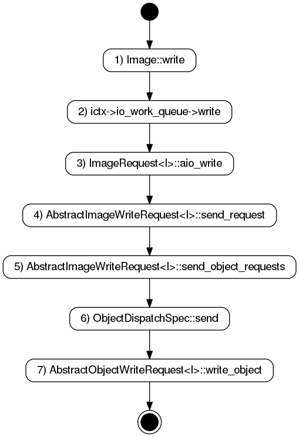

# rbd

## 写流程

每个Image维护了一个异步的正在进行中的操作的列表，`xlist<io::AsyncOperation*> async_ops;`，
在第5步中，从ImageRequest的队列中取出一个请求处理的时候，会把这个请求加入到async_ops中，后续
flush请求会等待async_ops中的全部操作都完成了才会返回。另外第7步中，一个ImageRequest可能对应了
多个ObjectRequest，所以AioCompletion会分成多个C_AioRequest，当所有的C_AioRequest都 finish的
时候，这个AioCompletion才会complete，最终调用async_op.finish_op();从async_ops链表中
删除这个完成的操作。

## 类之间的关系

在`AbstractImageWriteRequest<I>::send_object_requests`这个函数中，会把image
request的请求转化成对rados层的object的request的请求，object request相关类
的关系如下：

## 队列

io_work_queue: 

## QOS

## 相关配置项

|  配置项 |  默认值 |  含义  |
|---------|--------|----------|
|rbd_op_threads| 1 | number of threads to utilize for internal processing |
|rbd_op_thread_timeout| 60 | time in seconds for detecting a hung thread |
|rbd_non_blocking_aio| true | process AIO ops from a dispatch thread to prevent blocking |

## 问题
1. 多个对同一个区间的异步写请求，在处理的时候，如何保证顺序性？

2. flush的流程？怎么等待异步的write结束的？

3. cache？
