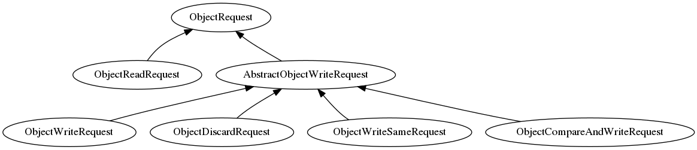

# rbd

## 写流程

## 类之间的关系

在`AbstractImageWriteRequest<I>::send_object_requests`这个函数中，会把image
request的请求转化成对rados层的object的request的请求，object request相关类
的关系如下：

## 队列

io_work_queue: 

## QOS

## 相关配置项

|  配置项 |  默认值 |  含义  |
|---------|--------|----------|
|rbd_op_threads| 1 | number of threads to utilize for internal processing |
|rbd_op_thread_timeout| 60 | time in seconds for detecting a hung thread |
|rbd_non_blocking_aio| true | process AIO ops from a dispatch thread to prevent blocking |

## 问题
1. 多个对同一个区间的异步写请求，在处理的时候，如何保证顺序性？

2. flush的流程？怎么等待异步的write结束的？

3. cache？
